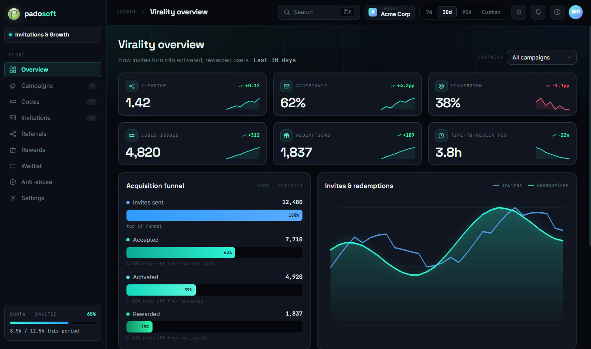
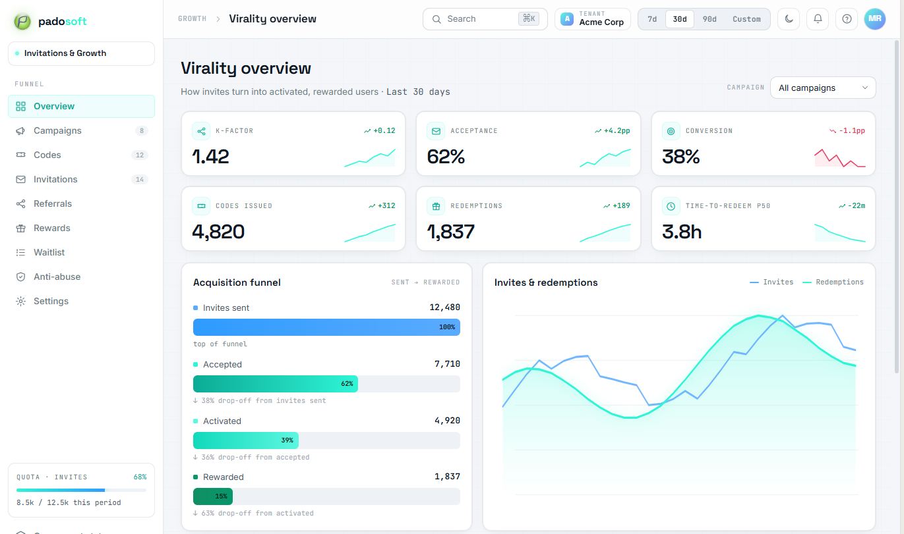
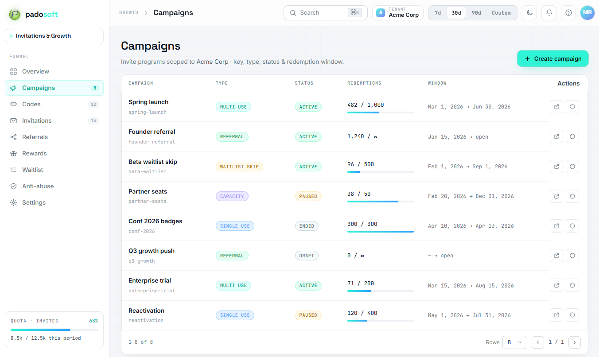
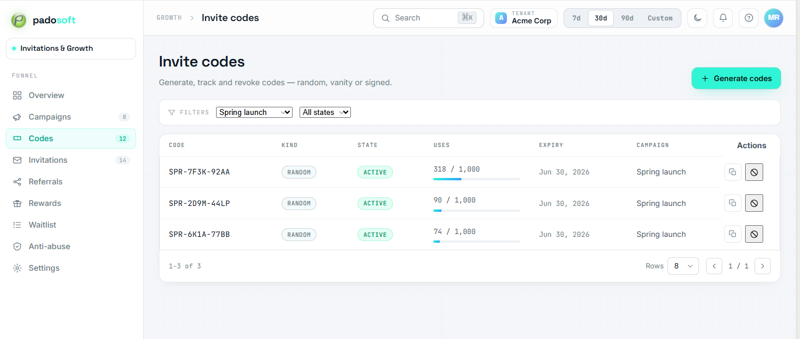
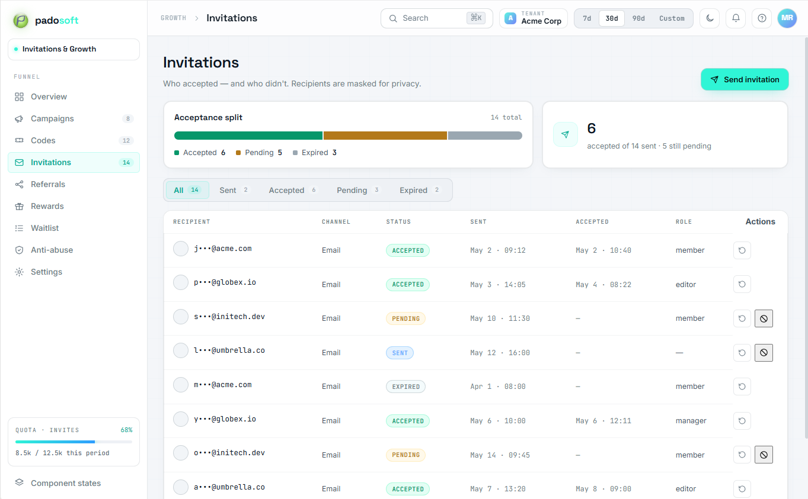
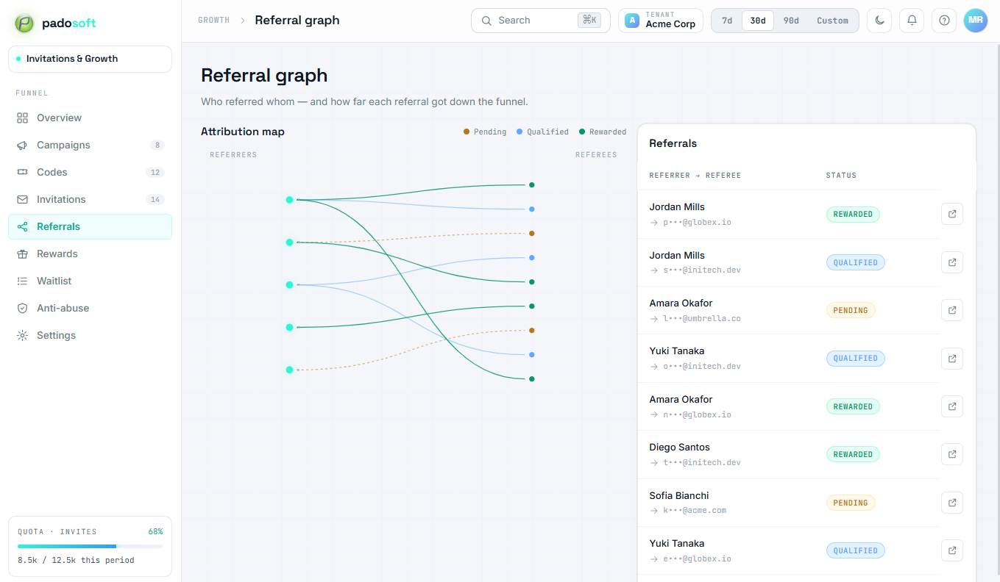
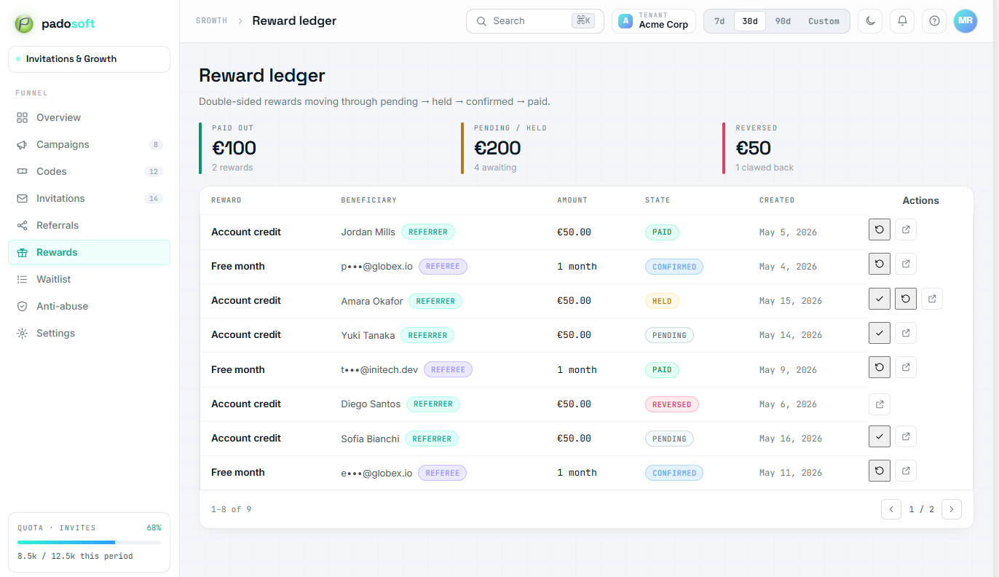
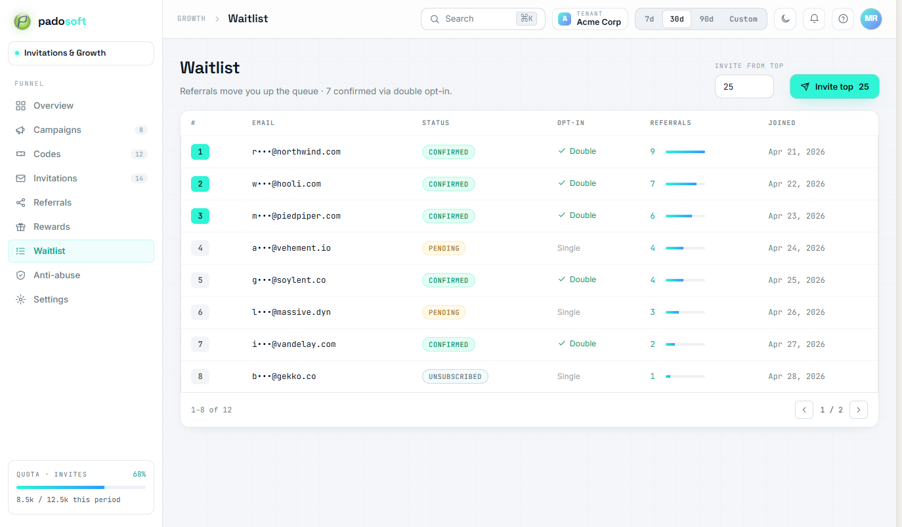
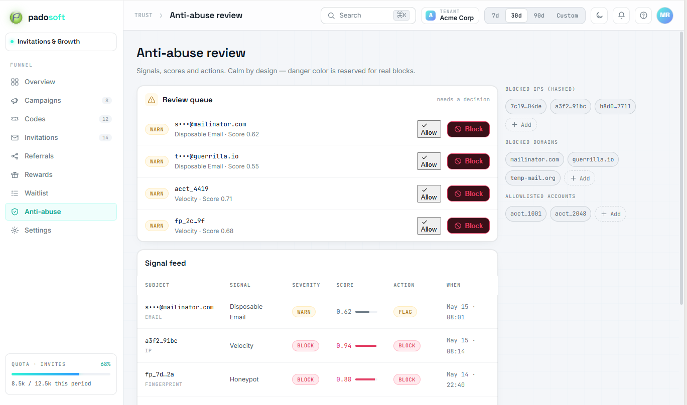
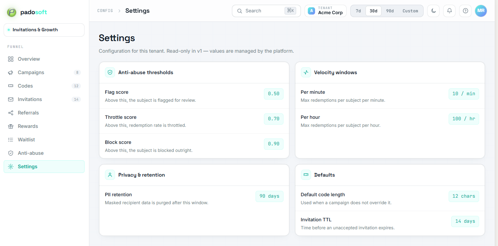

<div align="center">

# Laravel Invitations — Admin

**A polished, themeable React admin console for [`padosoft/laravel-invitations`](https://github.com/padosoft/laravel-invitations).**

Campaigns · invite codes · invitations (who accepted vs. who didn't) · referral graph · reward ledger · waitlist · anti-abuse review · virality analytics — over the headless core's HTTP API.

[](https://packagist.org/packages/padosoft/laravel-invitations-admin)
[](https://github.com/padosoft/laravel-invitations-admin/actions)
[](https://www.php.net)
[](https://laravel.com)
[](https://react.dev)
[](LICENSE)

</div>

> ⚠️ **Active development toward `v1.0.0`.** Eight of the nine screens (Overview, Campaigns, Codes, Invitations, Referrals, Rewards, Waitlist, Anti-abuse) are built, tested, and themeable against the live core API; Settings lands once the core exposes its config read endpoint.

---

## 🚀 AI vibe-coding pack included

This repo ships a complete AI pair-programming kit: [`CLAUDE.md`](CLAUDE.md) (engineering invariants
+ quality gates) and [`AGENTS.md`](AGENTS.md). Point Claude Code, Cursor, or Copilot at the repo and
they inherit the package's rules (default-OFF mount tested in both states, no backend logic in the SPA,
prebuilt-asset discipline, the test-id + a11y contract) automatically.

---

## What it is

A **turnkey, default-OFF admin SPA** that mounts over the core package's HTTP API. It adds **no backend
logic of its own** — every data call goes through the core's existing `/api/admin/invitations/*` routes,
behind the host app's own auth + RBAC. Enable it, gate it, done.

For apps that already run their own React SPA (e.g. AskMyDocs), the screens can be **adapted natively**
instead of cross-mounting this package — the design template that drives both lives in the core repo at
[`docs/ADMIN-DESIGN-BRIEF.md`](https://github.com/padosoft/laravel-invitations/blob/main/docs/ADMIN-DESIGN-BRIEF.md).

## ✨ Highlights

- 🎛️ **Enterprise SaaS console feel** — Linear / Vercel / Stripe-grade layout: dense-but-breathable tables,
  sticky headers, slide-over drawers, confirm modals, toasts.
- 🌓 **Light + dark theming** via a `[data-theme]` token set — **no raw hex in components**, so a host can
  re-skin the whole panel by overriding the CSS custom properties.
- 🧩 **Reusable component kit** — `DataTable`, `KpiCard` (with sparkline + delta), `StatBadge`,
  `SlideOverDrawer`, `ConfirmModal`, `Toast`, `FilterBar`, `GrantEditor`, `ChipsInput`, `MaskedEmail`,
  `CopyButton`, `SegmentedTabs`, and dependency-free SVG charts (`Sparkline`, `FunnelChart`,
  `TimeSeriesChart`).
- 🏢 **Multi-tenant grant editor** — the campaign drawer's headline feature: a primary grant **plus**
  repeatable per-tenant grants, so a single invite code can seed role + project access across several
  tenants. `super-admin` is never offered.
- ♿ **Accessibility baked in** — real `<label htmlFor>` on every control, roles/aria on the focusable node,
  Esc + focus-trap in drawers/modals, status badges that pair color with text, full keyboard reach.
- 🧪 **Test-friendly by contract** — stable `feature-resource-{id}-{action}` test ids and
  `data-state="idle|loading|ready|error|empty"` on every async surface, so Playwright/Vitest can wait on
  state instead of timeouts.
- 🔌 **Zero JS toolchain for consumers** — the prebuilt Vite bundle is committed to `resources/dist/` and
  served straight from the package. `composer require` and flip a flag.
- 🔒 **Default-OFF, host-gated** — `INVITATIONS_ADMIN_ENABLED=false` out of the box; OFF means no routes and
  a clean 404; ON means a Blade shell behind your middleware stack.

## Screens

A dark-first HUD console (Padosoft Design System — neon-cyan signal, Space Grotesk / Inter / JetBrains Mono),
with a derived light theme one click away. All nine screens are live and wired to the core API.

### Overview — virality dashboard

KPI cards (K-factor, acceptance/conversion rate, codes issued, redemptions, distinct referrers, time-to-redeem
p50/p90) + acquisition funnel + redemptions time-series, filtered by campaign + date range.




### Campaigns

Sortable table (key, name, type, status, redemptions, window) + a create/edit slide-over with the full
**multi-tenant GrantEditor** (primary grant + repeatable per-tenant grants) and inline per-field validation.



### Codes

Code table (copy, kind/state badges, uses progress, expiry) + campaign/state filters + a generate drawer with
copy-all / CSV export, and a destructive revoke confirm modal.



### Invitations

Status tabs + masked recipients + an accepted-vs-pending-vs-expired breakdown bar + a bulk send drawer.



### Referrals

A legible referrer → referee attribution graph beside a status-filtered table.



### Rewards

Double-sided reward ledger (beneficiary, party, type, amount, trigger, state) with state + party filters.



### Waitlist

Read-only queue ordered priority desc / position asc, masked emails, referral-count column + status filter.



### Anti-abuse

A calm signal feed (hashed subject, signal type, severity, score, action taken) with severity + action filters —
danger color reserved for real blocks.



### Settings

Read-only view of the tenant's invite configuration (anti-abuse thresholds, velocity windows, PII retention,
defaults).



## Install

```bash
composer require padosoft/laravel-invitations-admin
```

The package auto-registers. Publish the config to tune it:

```bash
php artisan vendor:publish --tag=laravel-invitations-admin-config
```

## Enable the mount

The mount is **OFF by default**. Turn it on and gate it with your admin middleware:

```dotenv
INVITATIONS_ADMIN_ENABLED=true
INVITATIONS_ADMIN_ROUTE_PREFIX=admin/invitations
INVITATIONS_ADMIN_API_BASE=/api/admin/invitations
INVITATIONS_ADMIN_TENANT_LABEL=acme
```

```php
// config/invitations-admin.php
return [
    'enabled'      => env('INVITATIONS_ADMIN_ENABLED', false),
    'route_prefix' => env('INVITATIONS_ADMIN_ROUTE_PREFIX', 'admin/invitations'),
    // The host supplies auth + RBAC here.
    'middleware'   => ['web', 'auth', 'can:manage-invitations'],
    'api_base'     => env('INVITATIONS_ADMIN_API_BASE', '/api/admin/invitations'),
    'tenant_label' => env('INVITATIONS_ADMIN_TENANT_LABEL', 'default'),
];
```

Visit `/admin/invitations` — the SPA boots and talks to the core API at `api_base` using the session cookie.
With `enabled=false` the route is absent and returns a clean 404.

### Cross-mounting into a host app (e.g. AskMyDocs)

This package is built to **cross-mount** into a host application exactly like the other `padosoft/*-admin`
sister packages — `composer require`, flip `INVITATIONS_ADMIN_ENABLED=true`, and gate the route group with the
host's admin auth + RBAC via `invitations-admin.middleware`:

```php
// config/invitations-admin.php (in the host)
'middleware' => ['web', 'auth', 'tenant.authorize', 'can:manage-invitations'],
```

What makes the cross-mount clean:

- **Self-contained bundle.** The prebuilt SPA (JS + CSS, fonts inlined via the DS `@import`) ships in
  `resources/dist/` and is served by the package's own asset route — the host needs **no** JS toolchain,
  no `npm`, no Vite config.
- **No same-origin assumptions beyond `api_base`.** The SPA's only backend dependency is the core API base
  URL (default `/api/admin/invitations`), injected into `window.InvitationsAdmin` by the Blade shell. Point
  `api_base` wherever the host mounts the core package's admin routes. All in-app navigation is client-side
  (no server routes per screen), so the single gated `GET {route_prefix}` serves every screen.
- **Session-cookie auth + CSRF.** The shell injects the CSRF token; the axios client sends it with
  `withCredentials`, so the host's existing session guard protects every API call.
- **Default-OFF is a clean 404.** With the flag off no routes are registered (verified in both states by the
  package's `MountTest`), so a fresh install of the host adds nothing until an operator opts in.

The host keeps full control of the auth boundary; this package only renders the console.

## Theming

The whole palette is driven by CSS custom properties on `[data-theme]` (`resources/js/theme.css`). To re-skin,
override the token block in your own stylesheet loaded after the SPA bundle:

```css
[data-theme='light'] {
  --color-primary: #0d9488;
  --color-primary-soft: #ccfbf1;
}
```

The in-app theme toggle persists the user's choice to `localStorage`.

## Develop the SPA

```bash
npm install
npm run dev        # Vite dev server
npm test           # Vitest + Testing Library
npm run typecheck  # tsc strict
npm run build      # emits resources/dist/ — commit the refreshed bundle
```

## Requires

[`padosoft/laravel-invitations`](https://github.com/padosoft/laravel-invitations) — the headless core that
owns the data, the HTTP API, and the MCP surface.

## Testing & quality gates

```bash
composer test       # PHPUnit (Testbench) — incl. the R43 default-OFF/ON mount test
vendor/bin/phpstan analyse   # level 5
vendor/bin/pint --test       # code style
npm run typecheck && npm test && npm run build
```

CI runs the PHP matrix (8.3 / 8.4 / 8.5 × Laravel 12 / 13) plus a JS build + test job on every push and PR.

## License

MIT © [Padosoft](https://www.padosoft.com)
